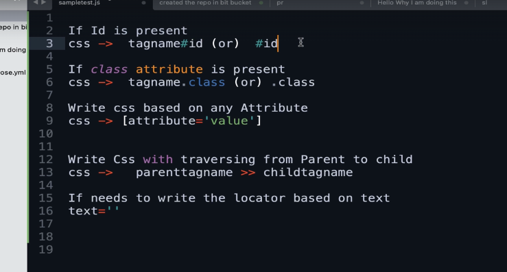
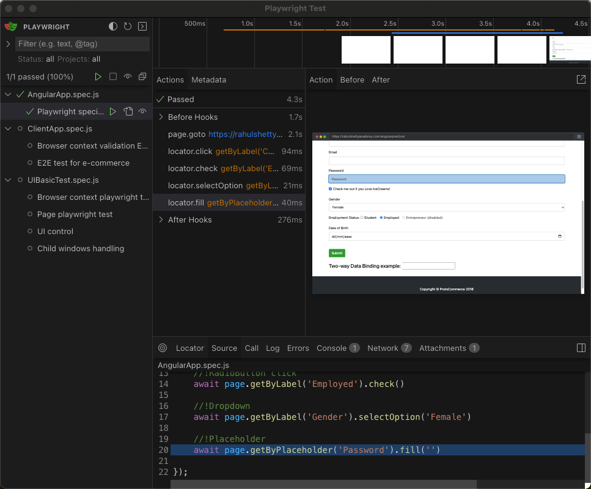
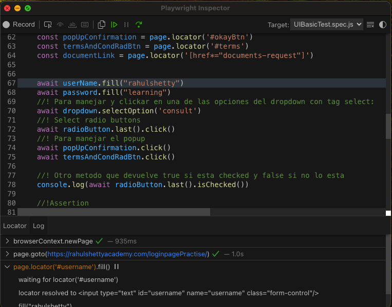

Reglas para selectores CSS

Comando para inicializar proyecto de Playwright: npm init playwright.

npx playwright test
    Runs the end-to-end tests.

  npx playwright test --ui
    Starts the interactive UI mode.

  npx playwright test --project=chromium
    Runs the tests only on Desktop Chrome.

  npx playwright test example
    Runs the tests in a specific file.

  npx playwright test --debug
    Runs the tests in debug mode.

  npx playwright codegen
    Auto generate tests with Codegen.

  Para ejecutar los test como ui interface;
  Lanzando este comando se abrira una terminal en la que podras ejecutar cualquier test y ver el codigo, network etc
  
    npx playwright test --ui

We suggest that you begin by typing:

    npx playwright test

Para iniciar un test en debug mode para ver donde falla lanzar el siguiente comando:
- "npx playwright test --debug"
Al lanzar este comando aparecera una ventana en la ejecucion en la que podras ir pasando paso por paso

Si en esta ventana hacer click en explore puedes seleccionar selectores para introducir en tu codigo. Ademas puedes validar los existentes.

Si quieres grabar las acciones que hagas en el navegador y que playwright te cree el test automaticamente tienes que hacer:
- "npx playwright codegen +c url a testear"
Despues de esto veras la pantalla donde se ira creando el codigo con todos los pasos que vayas haciendo.

And check out the following files:
  - ./tests/example.spec.js - Example end-to-end test
  - ./tests-examples/demo-todo-app.spec.js - Demo Todo App end-to-end tests
  - ./playwright.config.js - Playwright Test configuration

Esta linea tiene que ir encima de cada script para importar lo necesario para el test "const {test} = require ('@playwright/test')"

Esta es la estructura basica para crear un test:
¡IMPORTANTE! Desestructuramos el browser para que lo reconozca y podamos usarlo dentro del test
test('First playwright test', async ( {browser} ) =>

{
    

})

Si las pruebas estan en diferentes archivos al lanzar el comando npx playwright test se lanzara paralelamente.
En caso de estar en el mismo archivo se lanzara secuencialmente.

Por defecto playwright ejecuta los test de manera que no aparecen en pantalla. Para modificar eso tienes que añadir en el archivo de confi:
en consola lanzarlo con el comando npx playwright test --headed

Para que solo se ejecute un test poner en el principio del test "test.only"

