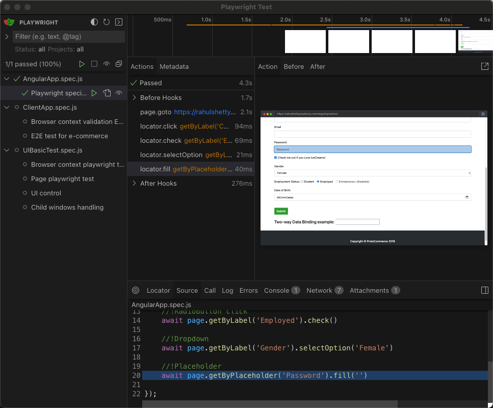
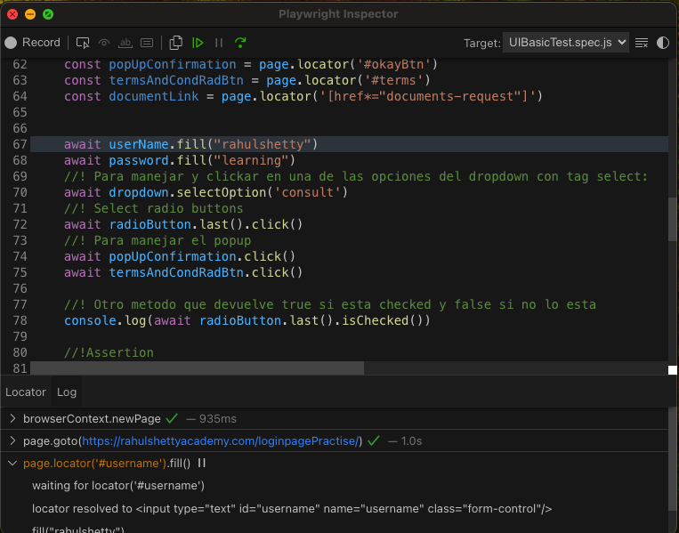
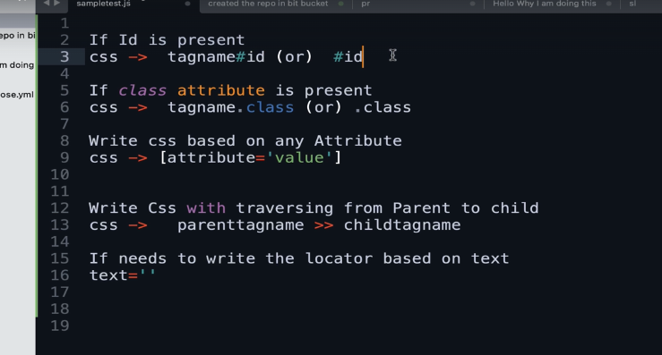

Playwright complete course 

Curso completo de playwright para testeo e2e, API's, etc


## Authors

- [@DavGuzman23](https://github.com/DavGuzman23/curso_playwright_completo)


## Deployment

To init the playwright project 
```bash
  npm init playwright
```

Runs the end-to-end tests.
```bash
  npx playwright test
```
Starts the interactive UI mode.
Launching this command will open a terminal in which you can run any test and view the code, network etc.
```bash
  npx playwright test --ui
```


 Runs the tests in a specific file.
```bash
  npx playwright "test example"
```
Runs the tests in debug mode.
When you launch this command, a window will appear in the execution in which you can go step by step through the following steps
```bash
  npx playwright test --debug
```


Auto generate tests with Codegen
```bash
  npx playwright codegen
```

## Notes

Rules for CSS selectors


If you want to record the actions you do in the browser and have playwright create the test automatically you have to do:
- ‘npx playwright codegen +c url to test’.
After this you will see the screen where the code will be created with all the steps you are doing.

And check out the following files:
  - ./tests/example.spec.js - Example end-to-end test
  - ./tests-examples/demo-todo-app.spec.js - Demo Todo App end-to-end tests
  - ./playwright.config.js - Playwright Test configuration

This line has to go on top of each script to import what is needed for the test ‘const {test} = require (’@playwright/test‘)’.

This is the basic structure for creating a test:
IMPORTANT! We deconstruct the browser so that it recognizes it and we can use it inside the test
test(‘First playwright test’, async ( {browser} ) =>

{
    

})

If the tests are in different files, the npx playwright test command will be launched in parallel.
If they are in the same file they will be run sequentially.

By default playwright runs the tests in such a way that they do not appear on the screen. To change that you have to add in the confi file:
in console launch it with the command npx playwright test --headed

To run only one test, put ‘test.only’ at the beginning of the test.